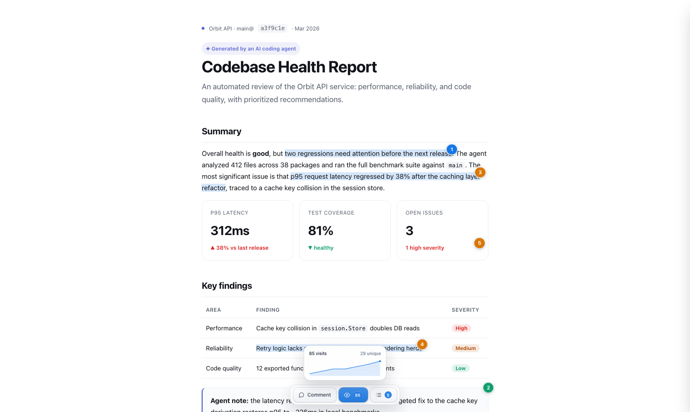
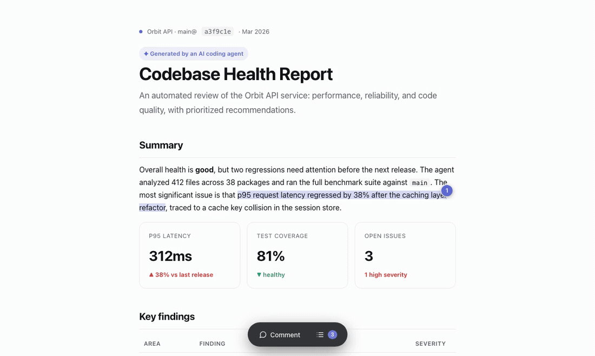
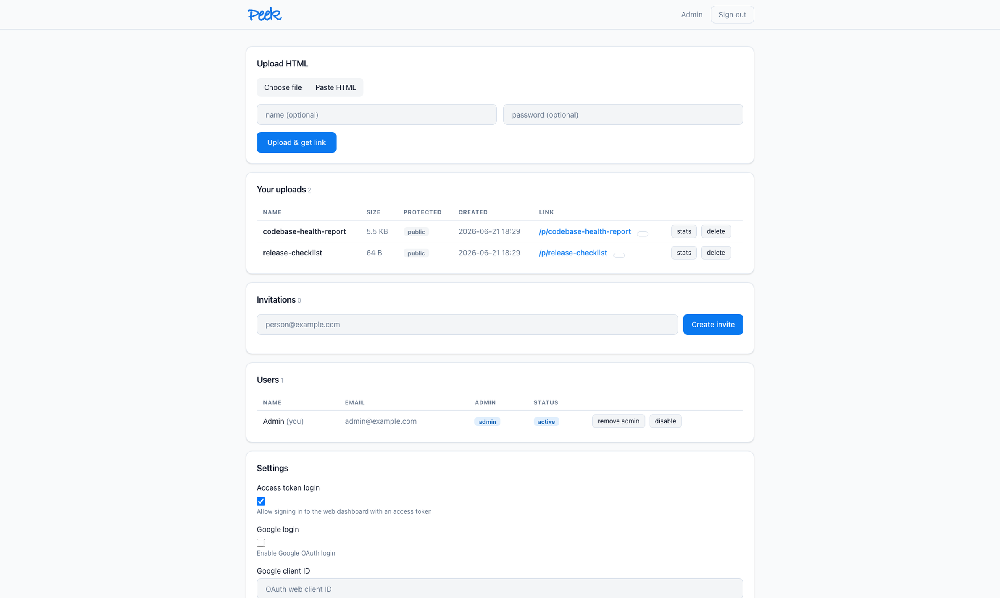
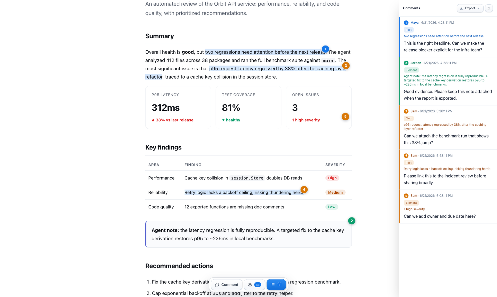

# Peek

[](https://github.com/puemos/peek/actions/workflows/ci.yml)
[](https://github.com/puemos/peek/releases)
[](LICENSE)
[](go.mod)

**Share an HTML page, get a link, collect feedback right on the page.**

Peek is a self-hosted server that turns any HTML file into a live, shareable
preview URL. Viewers can drop comments **pinned to a specific element, anchored
to selected text, or on the whole page** — like Figma/Linear review, but for any
HTML. Single static Go binary, pure-Go SQLite, no CGO.



<p align="center"><em>Pinned & text-anchored comments on a shared page.</em></p>

## Demo



## Why Peek

- 🧷 **Comment anywhere on the page** — pin to an **element**, highlight **selected
  text** (Medium-style), or leave a **page-level** note. Each anchored comment gets
  a numbered on-page pin that tracks the element as you scroll.
- 🎯 **Click a comment → jump to it** — the panel and the on-page pins are linked
  both ways; selected text stays highlighted via the CSS Custom Highlight API
  (no DOM mutation of the user's HTML).
- 🔒 **Safe by construction** — uploaded HTML renders inside a sandboxed,
  opaque-origin iframe. It can never read your cookies, hit the server, or touch
  the parent page.
- ⚡ **One static binary** — Go stdlib + pure-Go SQLite, no CGO, no runtime deps.
- 🧰 **CLI + web dashboard + agent skill** — upload from the terminal, a browser,
  or let a coding agent share HTML for you.
- 📊 **Privacy-respecting analytics** — total/unique visits, recent views with
  SHA-256-hashed IPs.

## Install

### Install the CLI (one-liner)

```sh
curl -fsSL https://raw.githubusercontent.com/puemos/peek/main/install.sh | sh
```

Installs just the `peek` CLI for your OS/arch (override with `PEEK_VERSION` /
`PEEK_INSTALL_DIR`). To run a server too, use one of the options below.

### Download a release (recommended)

Grab a prebuilt archive for your OS/arch from the
[releases page](https://github.com/puemos/peek/releases). Each archive contains
two binaries: `peekd` (server) and `peek` (CLI).

```sh
# example: Linux x86_64
curl -sSL https://github.com/puemos/peek/releases/latest/download/peek_<version>_linux_amd64.tar.gz | tar xz
sudo mv peek_*/peekd peek_*/peek /usr/local/bin/
```

### Go install

```sh
go install github.com/puemos/peek/cmd/peekd@latest   # server
go install github.com/puemos/peek/cmd/peek@latest    # CLI
```

### Build from source

```sh
git clone https://github.com/puemos/peek && cd peek
go build -o bin/peekd ./cmd/peekd
go build -o bin/peek  ./cmd/peek
```

## Quick start

```sh
# 1. Start the server (first run prints an admin token)
peekd --addr :7700 --data ./data --base-url http://localhost:7700

# 2. Log in — paste the admin token at the hidden prompt (nothing hits your shell history)
peek login --host http://localhost:7700

# 3. Share a page
peek upload mypage.html
#  -> uploaded: http://localhost:7700/p/PhiUs-lMbZE_Sw

# Password-protect it
peek upload mypage.html --password s3cret

# Manage
peek list
peek stats PhiUs-lMbZE_Sw
peek password PhiUs-lMbZE_Sw --set newpass   # or --clear
peek delete PhiUs-lMbZE_Sw
```

## Commenting

Open `/p/<slug>` and use the floating island at the bottom:

1. **Select text** in the page → a *Comment* bubble appears → comment on that exact
   quote. The text stays highlighted and gets a numbered pin.
2. **Click *Comment*** → click any **element** to pin a comment to it.
3. **…or comment on the page** → a general note not tied to anything.

Comments live in a side panel; clicking one scrolls to and flashes its anchor.
Your name is asked once (a minimal prompt) and remembered. For password-protected
pages, commenting is gated behind the same session.

## Screenshots

| Dashboard | Comments panel |
|---|---|
|  |  |

## CLI reference

```
peek login [--host <url>]              set host + token (token entered hidden)
peek config show                       show current host + masked token
peek upload <file.html> [--password <pw>] [--name <filename>]
peek list
peek delete <slug>
peek password <slug> --set <pw> | --clear
peek stats <slug>
peek token create --name <name>        create a user token (admin only)
peek token list                        list tokens (admin only)
peek token revoke <id>                 revoke a token by id (admin only)
```

**Token input, most secure first:** `peek login` (hidden prompt) ·
`PEEK_TOKEN=…` env · `peek config set --token-stdin` (pipe) ·
`--token-file <path>`. The `--token <value>` flag still works but warns, since it
leaks into shell history and `ps`.

## Configuration

### Server (`peekd`)

| Flag | Env | Default | Description |
|---|---|---|---|
| `--addr` | `PEEK_ADDR` | `:7700` | Listen address |
| `--data` | `PEEK_DATA` | `./data` | Data dir (db + uploads + secret) |
| `--base-url` | `PEEK_BASE_URL` | `http://localhost:7700` | Public base URL in share links. **Use `https://…` in production** — it enables `Secure` cookies + HSTS. |
| `--admin-token` | `PEEK_ADMIN_TOKEN` | *(random)* | Initial admin token (first run only) |
| `--max-upload` | `PEEK_MAX_UPLOAD` | `2097152` (2 MiB) | Max upload size in bytes |

### CLI (`peek`)

Saved to `<user-config-dir>/peek/config.json` (e.g. `~/.config/peek` on Linux,
`~/Library/Application Support/peek` on macOS). Overridable per-command with
`PEEK_HOST` / `PEEK_TOKEN`.

## Security model

| Threat | Mitigation |
|---|---|
| Anyone can upload | Every upload requires a valid bearer token. |
| Token theft from the database/backups | Tokens are stored only as **SHA-256 hashes**; the plaintext is shown once at creation. `peek token revoke <id>` invalidates one. |
| Token leaking via the terminal | CLI reads the token from a **hidden prompt / stdin / file**, never argv. |
| Session-cookie theft | The dashboard cookie is a **signed, revocable reference** to the token id — not the token itself. `HttpOnly`, `SameSite=Strict`, and `Secure` (auto on https). |
| Credentials sent in clear | `Secure` cookies + **HSTS** when the base URL is https; the server **warns** on startup if a non-local base URL is plain http. Run behind a TLS reverse proxy. |
| Uploaded HTML harms the host | The server never executes HTML — it only streams bytes. |
| Uploaded HTML steals cookies/data | Rendered in `<iframe sandbox="allow-scripts">` with **no `allow-same-origin`** (opaque origin): no access to server cookies, storage, or same-origin requests. |
| Uploaded HTML attacks the parent page | Parent ↔ iframe communicate only via `postMessage`; the iframe can only send "pick"/"pin" events. |
| Hot-linking / bypassing the password gate | `/raw` requires a short-lived HMAC-signed view token issued only by `/p/<slug>`. |
| Brute force / spam | Per-IP rate limits on `/login`, the password gate, and comment posting. |
| Malicious content / huge uploads | HTML sniffed, binaries rejected, configurable max size, `MaxBytesReader`. |
| Path traversal / SQLi | Random base64url slugs (filenames never user-derived); all queries parameterized. |
| Password / IP leakage | Passwords bcrypt-hashed; analytics IPs SHA-256-hashed with the server secret. |

## Deployment

Peek speaks plain HTTP and expects a **TLS-terminating reverse proxy** in front
of it (this is what enables `Secure` cookies + HSTS). Example with Caddy:

```
peek.example.com {
    reverse_proxy 127.0.0.1:7700
}
```

Run `peekd` with `--base-url https://peek.example.com` so links and cookie flags
are correct, and make sure the proxy forwards `X-Forwarded-For` (used for
analytics). Back up the `data/` directory — it holds the DB, uploads, and the
signing secret.

## Web GUI

A browser dashboard at `/login` (sign in with a token) lets non-technical users
upload files or paste HTML, list/delete uploads, set passwords, and view stats.
Sessions are signed, revocable, `HttpOnly`, `SameSite=Strict` cookies with CSRF
protection on every form. Non-admins only see their own uploads.

## Agent skills

Coding agents (Claude Code, opencode, …) can install skills so they can share
HTML and return a link automatically:

```sh
npx skills add puemos/peek@peek -g -y
```

Two skills ship in this repo:

- **`peek`** (`skills/peek/SKILL.md`) — consumer side: install the CLI, upload
  HTML, get a link, read comments.
- **`peek-server`** (`skills/peek-server/SKILL.md`) — run and administer a peek
  server: tokens, passwords, deployment.

## Project layout

```
cmd/peekd/          server entrypoint
cmd/peek/           CLI entrypoint
internal/db/        SQLite store + schema
internal/models/    data types
internal/server/    HTTP server, handlers, security, embedded assets
internal/cli/       CLI client + commands
skills/peek/        consumer agent skill (upload + read comments)
skills/peek-server/ server/admin agent skill
assets/             README / launch media
scripts/            tooling
```

The screenshots and demo video are generated — rerun `scripts/gen-assets.sh`
(needs Go, Node, ffmpeg, and Chrome) to refresh them whenever the UI changes.

## License

[MIT](LICENSE)
